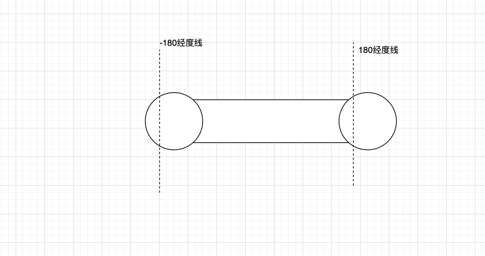

# 在地图中框选, 搜索结果在区域外的问题记录

## 具体描述

使用圆形搜索/多边形搜索控件, 如果框选区域跨过了180经度线,  结果点集会出现在选框外.

## 问题分析



选中区域是根据n个点的经纬度坐标来共同描述的(圆形也会被转化为正32边形), 因为地球是个球体, 被转化成平面图平铺以后, 如果选中的区域跨过了180经度线, 以-180度为例, 超过的部分经度会+360(假如原坐标是-190, 这时会回到170).

这时, 点集所描述的区域变成了图中的长方形区域, 即: 跑到了框选的圆外

## 解决办法

1. 将地图的东经180, 西经180两条线作为地图的边界固定住
2. 即使固定住边界, 圆形搜索的控件, 圆形依然有可能溢出屏幕外, 即有可能跨过180经度线. 如何解决? 
    + 首先尝试查找openlayers API, 直接限制圆形大小, 不能溢出到屏幕外. 结果没有找到相应API
    + 手动找到那些"溢出并跨过180经度线"的点, 将经度改回到180经度线附近, 去掉溢出部分面积(这部分实际上也在屏幕可视区域外)

实现思路是根据圆的对称性, 如果没有溢出, 那么对所有点的经度取平均值,应该等于圆心的经度值(这里没有考虑半径过大, 导致双边都"溢出"的情况, 这时需要直接限制圆的半径)

部分代码:
```js

const avgLng = Math.round(lonlats.map(v => v.lng).slice(0, 32).reduce((acc, v) => acc + v, 0) / 32)
const centerLng =  Math.round(center[0])
if (avgLng !== centerLng) {
  for (let i = 0; i < 16; i++) {
    const item1 = lonlats[i]
    const item2 = lonlats[i+16]
    if (Math.round((item1.lng + item2.lng) / 2) !== avgLng) {
      if (avgLng > centerLng) {
        const val = -179.999
        if (item1.lng > item2.lng) {
          item1.lng = val
        } else {
          item2.lng = val
        }
      } else {
        const val = 179.999
        if (item1.lng > item2.lng) {
          item2.lng = val
        } else {
          item1.lng = val
        }
      }
    }
  }
  lonlats[32] = lonlats[0]
}
```

## 遗留的问题

纬度也有类似的"溢出"问题, 但是相对问题较小暂未处理. 如果"溢出"-90度, 假如原始点是-100, 这时会回到-80, 最终导致选中区域比视觉上的区域要小一点;

