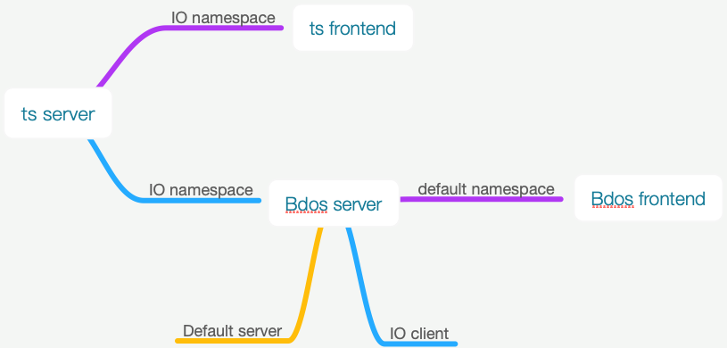

# Sharing

## 网站的响应式设计与一些相关技术

### 网站的几种响应式设计实现

1. css 的媒体查询与 bootstrap 的栅格布局
2. 通过 ***UA检测*** 配合服务端的一些模板技术来实现模板的切换达到适配
3. 通过 UA检测进行重定向,维护两套独立的网站来分别适配 pc 端和 mobile 端

#### 1. 媒体查询与栅格布局

```css
/* example */
@media screen and (max-width: 1919px) and (min-width: 1440px) {
   .wrapper {
       /* ... */
   }
}

/* bootstrap */
.col-md-3 {

}
```
例子: [Princle One 官网](https://www.princle.com/)

***优缺点:*** 简单易实现; 强依赖 pc 端与 mobile 端 内容的一致性. 网站较复杂时有很多的冗余代码.这是说:

1. 如果 pc 端与 mobile 端展现内容不一致(dom 不一致), 媒体查询很难去做(当然也有办法).
2. 网站规模较大时,媒体查询的 overwrite 方式容易变得代码难以维护(dom 变更,css 优先级的意外变更导致展示出错);另外,因为 css 里同时包含了多版的代码,体积较大,也会影响网站的初次加载时间.

#### 2. UA 检测 + 模板技术

服务端获取 user-agent(浏览器) 信息,判断访问来源是 pc 端还是 mobile 端或是其他设备, 来选择不同的模板加载.

php 实现:

```php
// 检测是否为 mobile
function is_mobile () {
  $ua = strtolower($_SERVER['HTTP_USER_AGENT']);
  return ((contains($ua, "android") && contains($ua, "mobile")) || 
    (contains($ua, "android") && contains($ua, "mozilla")) || 
    (contains($ua, "android") && contains($ua, "opera")) ||
    contains($ua, "ucweb") || 
    contains($ua, "iphone"));
}

function contains ($a, $b) 
{
  return (strpos($a, $b) !== false);
}

```

例子: [Linktime Cloud 官网](https://www.linktimecloud.com/)

页面结构:
页面用模板拆分,基础结构: header 模板 + content 模板 + footer 模板; header 模板和 footer 模板根据 UA(pc / mobile) 加载不同的 css 与js 文件; content 模板拆分为template-pc, template-mobile, template-common三类(复用 pc 与 mobile 一致的模板).

这里官网中没有拆开 js 文件,因为绝大部分js脚本是相同的,拆开了 css文件,需要配合 webpack 的多入口代码打包.

```js
// 部分 webpack 配置
module.exports = {
    entry: {
        common: ['./src/scripts/common.js'],
        assets_web: [cssBase + 'common.scss'],
        assets_mobile: [cssBase + 'common_mobile.scss']
    },
    module: {
        rules: [
            {
                test: /\.scss$/,
                use: [
                    MiniCssExtractPlugin.loader,
                    {
                        loader: 'css-loader', // translates CSS into CommonJS
                        options: {
                            url: false
                        }
                    },
                    "postcss-loader",
                    "sass-loader" // compiles Sass to CSS, using Node Sass by default
                ]
            },  
        ]
    }
}
```

优点: 更灵活,不限制 pc 端与 mobile 端内容的一致性,同时也可以复用一致的模板,代码拆分后更容易维护.网站首次加载更快.

3. UA检测 + 重定向

```js
// 客户端的重定向
const ua = navigator.userAgent.toLowerCase();
if (isMobile(ua)) {
    window.location.href = 'http://mobile.some.com'
}

function isMobile (ua) {
    // ...
}
```
优缺点: 需要维护两套独立的服务(pc / mobile)

### 其他的一些响应式技术

1. 图片的响应式加载 / 呈现
2. canvas 的响应式
3. ...

#### 图片的响应式呈现:
```css
.responsible-1 {
    /* cover | contain */
    background-size: cover
}
.responsible-2 {
    width: 100px;
    height: 100px;
    /* cover | contain */
    object-fit: cover
}
```

#### 图片的响应式加载(根据屏幕分辨率,预留尺寸动态加载图片):

1. srcset + sizes
```html
    
    <!--  这里也可以添加媒体查询 -->
    
```
2. image-set (目前的兼容性还较差)

```css
  background-image: url(small.jpg);
  background-image: 
    -webkit-image-set(
      "small.jpg" 1x,
      "medium.jpg" 2x,
    );

```

#### canvas 的响应式

因为 canvas 本质上也是位图,所以在 retina 屏幕上会显得很模糊. 解决办法:

```js
// 通用模板

 const canvas = document.querySelector('canvas')
 const ctx = canvas.getContext('2d')
 // 屏幕的设备像素比
 let devicePixelRatio = window.devicePixelRatio || 1
 // 浏览器在渲染canvas之前存储画布信息的像素比
 let backingStoreRatio = ctx.webkitBackingStorePixelRatio ||
     ctx.mozBackingStorePixelRatio ||
     ctx.msBackingStorePixelRatio ||
     ctx.oBackingStorePixelRatio ||
     ctx.backingStorePixelRatio || 1
 let ratio = devicePixelRatio / backingStoreRatio

 const width = canvas.clientWidth * ratio
 const height = canvas.clientHeight * ratio
 canvas.width = width
 canvas.height = height
 ctx.scale(ratio, ratio)
```

```js
// canvas 动画模板
const canvas = document.querySelector('canvas')
const ctx = canvas.getContext('2d')
const devicePixelRatio = window.devicePixelRatio || 1
const clientWidth = canvas.clientWidth
const clientHeight = canvas.clientHeight
canvas.width = clientWidth * devicePixelRatio
canvas.height = clientHeight * devicePixelRatio
ctx.scale(devicePixelRatio, devicePixelRatio)
// start draw
const totalValue = 2000
const duration = 30
let step = -1
let handle
frame()
function frame () {
  if (++step < duration) {
    ctx.clearRect(0, 0, clientWidth, clientHeight)
    // 用各种缓动函数计算出当前的状态值
    const curValue = Tween.easeInOut(step, 0, totalValue, duration) 
    // some draw action...
    handle = requestAnimationFrame(frame)
  } else {
    cancelAnimationFrame(handle)
  }
}

```

## SocketIO 介绍

1. 分别有客户端和服务端两个库(多语言实现);
2. SocketIO 和 websocket 类似, 但不是标准的 websocket 实现;
3. 几个引入的概念: `namespace`, `room`

`namespace`用来定义 SocketIO 实例; `room`用来群发消息,比如将某个用户组的用户加入到一个 room 中,就可以对这个 room 广播消息.

### 工单系统的 socketIO 设计:



## BDOS css 重构工作的一些思考

工作的主要目的: 屏蔽掉底层不同组件库的UI 差异,形成统一的设计风格,与设计规范保持一致.

历史背景: 项目早期没有设计师介入,没有统一的设计规范, 使用了两套组件库(elementUI + bootstrap), 后面随着不断迭代,前端代码已经比较庞大.

两种重构方案:
1. 因为 elementUI / bootstrap 都提供了较详细的  sass 变量表,来控制编译后的 css 输出,所以可以直接改 sass 变量值.
2. 外部 overwrite 的方式,再加一层包裹

各自的问题:
1. 可能需要不少时间去读源码, 需要很熟悉组件库的源码与变量映射表; 有些样式可能无法百分百还原设计.
2. 开发时间相对较短,但是可能会打破组件库源码的 css 优先级,产生一些意料之外的问题.具体例子:

```css
/* 组件库源码 */
.btn {
    color: #e5e5e5
}
.btn-red {
    color: #ff0000;
}
.btn-black {
    color: #000000;
}

```

```css
/* 自定义包裹层,统一UI */
.btn {
    color: #fff
}
.btn-red {
    color: pink
}

```

```html
<!-- 调用方式 -->
<!DOCTYPE html>
<html lang="en">
<head>
    <meta charset="UTF-8">
    <meta name="viewport" content="width=device-width, initial-scale=1.0">
    <meta http-equiv="X-UA-Compatible" content="ie=edge">
    <title>Document</title>
    <link rel="stylesheet" href="./lib.css">
    <!--  自定义包裹层 -->
    <link rel="stylesheet" href="./custom-theme.css">
</head>
<body>
    <!-- #fff,  正确 -->
    <div class="btn">default</div>
    <!-- pink, 正确 -->
    <div class="btn btn-red">red</div>
    <!-- #fff, 出错了! -->
    <div class="btn btn-black">black</div>
</body>
</html>

```

这里实际开发中的问题是,如果不深入到众多的业务组件里去一个个更改组件的 css class, 并且 ***css overwrite 的范围没有覆盖到组件库的所有内容***, 就可能会引发上述的问题.


