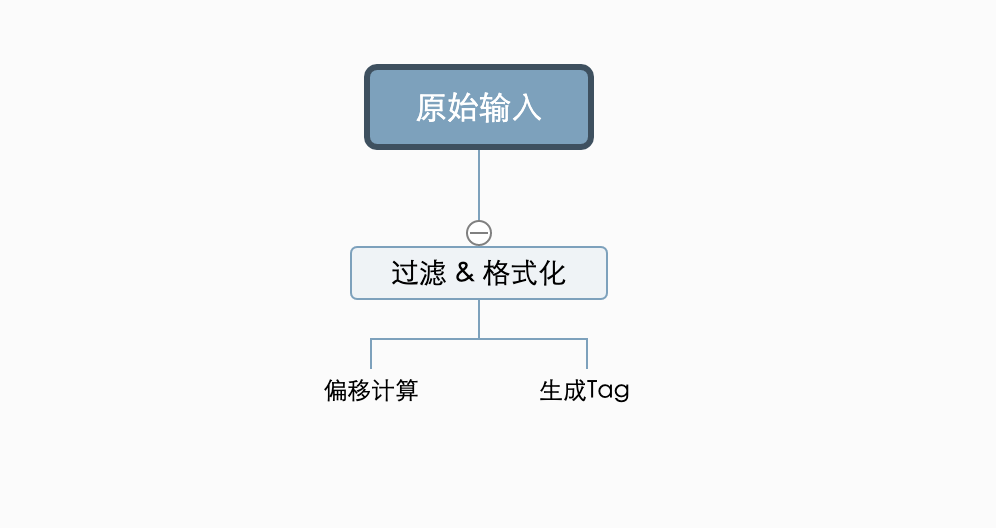
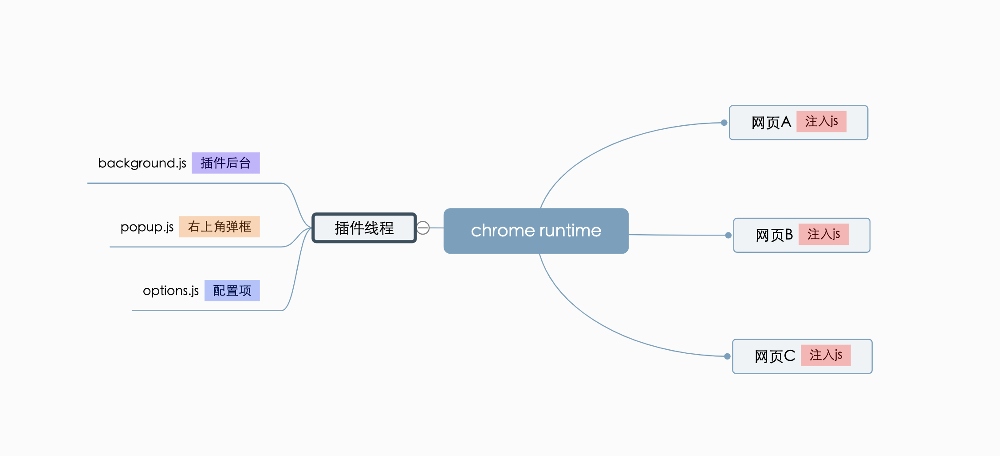

# Profile 文档与标签优化总结

**行文目录**

+ Profile 文档与标签
    + 标签系统
        + 最初的实现
        + 存在的问题
        + 改进方案
    + 其他的一些优化
        + html 模式优化
        + Ner 分词优化
    + 有待讨论的地方
+ chrome抓取插件
    + 开发原因
    + 基本实现思路
    + 目前的一些问题

## Profile 文档与标签

### 最初的实现

核心的浏览器API `getSelection`,`selectstart`,实现对选中文本的获取;
在网页的dom结构中,有两种渲染文本的方式:
+ 一种当做纯文本来渲染: `dom.textContent = 'some string'`
+ 另一种当做html来渲染: `dom.innerHTML = 'some string'`

因为需要对标签着色以及拖拽等交互操作,所以这里文本需要当做html来渲染;在只考虑txt格式的基础下,标签的生成与渲染计算较为简单.最终生成的文本形式如下:
```js
some text1;
<em>标签A</em>
some text2;
<em>标签B</em>
...
```
计算待生成标签(选中文本)相对于原始文本的字符串偏移量,保存;渲染时,将所有标签按偏移量排序后,倒序插入.

#### 存在的一些严重问题

在系统支持URL抓取以后, 这种实现无法支持html渲染(把第三方网页直接插入当做html来渲染).具体的一些严重问题:
+ 同时引入的第三方css会覆盖掉部分系统的css代码,导致系统样式大面积出错.
+ 插入了额外的dom标签到网页中后(此时dom树的深度不再是1),原本的标签偏移量计算规则出错了.
+ 引入的第三方js出错,会导致当前页面崩溃掉,没有隔离机制.
+ 没有隔离机制,可以很容易进行xss攻击(尽管`html5`不会执行由`innerHTML`插入的`script`标签代码).

一个xss攻击的示例:
```js
const payload = "";
el.innerHTML = payload; // shows the cookie, then send to somewhere
```

### 改进方案
在不改变标签存储方式的基础上(计算偏移量+字符串拼接),对html文本先做内容过滤,再用于渲染.
具体的过滤操作,类似于一些防止xss注入攻击的库做的事情,可以考虑引入第三方库来做这个事情.


```js
const regex = /<script.*?<\/script>|<style.*?<\/style>|<noscript.*?<\/noscript>|<code.*?<\/code>|<textarea.*?<\/textarea>|<link.*?>|<[^>]+>|&lt;|&gt;/gsi;
```
这里直接过滤掉了script,link等标签的内容,以及去掉了所有的html标签.
为了优化最终展示的内容排版,对多余的空格,换行做了处理.
```js
const formatHtml = input.replace(/( |\t|\v|\f)*\n( |\t|\v|\f)*/gs, '\n').replace(/\n{2,}/gs, '\n')
```

最终的完整文本处理函数像这样:
```js
    function PrettyFormatText(str) {
        const regex = /<script.*?<\/script>|<style.*?<\/style>|<noscript.*?<\/noscript>|<code.*?<\/code>|<textarea.*?<\/textarea>|<link.*?>|<[^>]+>|&lt;|&gt;/gsi;
        let tmp = str.replace(regex, '')
        return tmp.replace(/( |\t|\v|\f)*\n( |\t|\v|\f)*/gs, '\n').replace(/\n{2,}/gs, '\n')
    }
```

### 文档在HTML模式下的展示优化

#### 最初的实现
把原始的html放到iframe中去渲染.开启`sandbox`模式,禁用js脚本.
注意: ***这里需要禁用js脚本,因为脚本执行错误会导致iframe容器崩溃,由于cors的存在,脚本执行出错似乎是无法避免的***

#### 在此基础上的一些优化

+ 向iframe中注入一些css代码,保持和父级容器的样式一致.
修改滑动块:
```js
const injectStr = `
    <style>  
    ::-webkit-scrollbar {
      width: 6px;
      height: 6px;
      box-sizing: border-box;
      overflow: hidden;
      background: hsla(0, 0%, 100%, 0.6);
    }
    </style>
    ...
`
const html = text.replace(/<head>/, `<head>${injectStr}`)
```
+ 由于部分网站的防盗链机制,iframe中嵌入的网页在加载远程静态资源时,可能会被拦截.具体来说,大部分网站采用的是判断`referrer`是否是当前域名或指定的白名单域名.这时,客户端可以通过设置`<meta name="referrer" content="no-referrer" />`,不发送`Referrer`信息,从而绕过检测.

### NER 分词打标签的优化

一方面,`NER`在处理html网页(非纯文本)时,分词效果很差;另一方面,展示的网页已经被前端自定义过滤处理过;故对旧接口做了一些改造,前端会在请求时带上经过滤处理后的文本内容,而非基于原始html直接做分词.

### 有待讨论与持续优化的问题

+ 联合搜索命中的文本,在展示时可能已经被过滤掉,无法直观看到.(部分被过滤内容可能有意义)
+ 从防止xss注入的角度考虑,过滤机制是否完善?
+ 即使在iframe中加上了`no-referrer`的隐私策略,由于`cors`的存在,js脚本执行出错似乎是无法避免的,必须要禁用掉.这样网页的展示效果是无法百分百还原的.


## 用于网页抓取与生成标签的 chrome 插件

### 开发背景
如上面所说,在系统中抓取的网页始终无法百分百还原样式.使用chrome 插件则不需要面对这个问题.

### 插件架构


### 基本实现思路
+ 标签的生成思路同系统中类似,通过记录偏移量;
+ 在抓取网页的过程中做了优化,因为可以拿到网页的源码,直接写入文件,通过文件上传的形式,导入到系统中,速度稳定性大大提高;
+ 在打开标签配置弹框后提前静默抓取网页,避免提交后过长等待.
+ 为了避免重复抓取相同网页,同时如果网页内容更新,则需要重新抓取.这里需要判断网站的版本是否已更新;判断网站更新情况有些麻烦,这里是直接对源码中的字符串一一做比较.但是由于一些动画,脚本本身就在持续更新自己的dom,所以这里同样是,先对源码做过滤,去掉html标签,再进行比较;由于部分脚本可能延时加载,目前仍有少量误差.

### 目前的一些问题
+ 插件可以申请到权限拿到网页的cookie,从而实现免登陆直接使用.但是由于deepfinder系统本身设置了cookie的访问设置`httpOnly`,导致无法读取cookie,如果系统放开这一限制,可能又会有安全隐患.
+ 目前标签的偏移量计算是简化处理,简单判断在源码中第一次出现的位置,与实际选中位置可能有差异(选中文本重复出现的情况下)
+ 在网站上生成的标签,在系统profile中可能无法展示;因为可能选中了部分敏感内容,渲染时被提前过滤掉了.

### 插件开发的填坑记录

+ 由于只服务chrome,可以使用绝大部分最新js语法,不用借助于babel等编译工具;但是语法在插件环境中可能有bug;例如:
在`background.js`中使用`let`定义的变量无法像`var`一样跨文件共享.
+ 第三方网页上加载的代码需要注入进去.引入`vue`,`react`,`antd`等框架有些麻烦,同时体量也会较重;需要自己实现一些基础组件.
+ 插件的消息与存储几乎都是异步实现,代码逻辑不是太直观.

## 更新

后续的2.0版本完美支持了直接对网页打标签..

